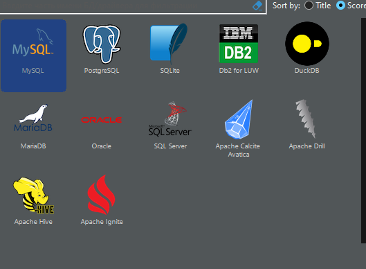

В данной инструкции будут описаны шаги по настройке Docker контейнера с PostgreSQL и MySQL и подключение к базам в DBeaver.  
*Данная инструкция написана для Windows, но в целом различий с Linux версией нет*

## Создание и запуск контейнера с PostgreSQL
1. Параметры контейнера
>--name postgres-db 
Название контейнера. Необходимо для определения контейнера среди других в Docker
>
>-p 5432:5432
<Внешний порт>:<Внутренний порт>
Внешний порт присваивает порт ведущий наружу контейнера, для пожключения к нему. Внутренний порт указывает порт сервиса для переброски портов. 
>
>-e POSTGRES_USER=postgres
Имя пользователя базы данных
>
>-e POSTGRES_PASSWORD=password
Пароль базы данных
>
>-e POSTGRES_DB=testdb
Имя базы данных
>
>-v D:\\psql:/var/lib/postgresql/data
<Путь к данным базы вне контейнера>:<Путь к данным базы в контейнере>
Поскольку, данные сбрасываются после перезапуска контейнера, необходимо явно указать расположение базы данных или где сохранить базу данных локально. Необходимо просто заменить `D:\psql` на желаемый путь
>
>-d postgres:15.2
<образ>:<версия>
Если не указать версию, то по умолчанию будет запущена последняя версия. Это необходимо, когда вам нужна конкретная версия базы

2. Запуск контейнера
В итоге у нас должна получиться следующая строка:
```powershell
docker run --name postgres-db -p 5432:5432 -e POSTGRES_USER=postgres -e POSTGRES_PASSWORD=password -e POSTGRES_DB=testdb -v D:\psql:/var/lib/postgresql/data -d postgres:15.2
```

Вставляем её в Powershell и ждём, пока скачается образ и создастся и запустится контейнер

Затем, когда всё завершится, прописываем `docker ps -a`. Эта команда отобразит все активные и не активные контейнеры, а те же их статус. Должно быть вот так:  


Видим запущенный контейнер. Если в поле Status отображается Up, значит контейнер в данный момент запущен. Если Exited (0), значит контейнер остановлен без ошибок. Если отображается что-то отличное от (0), значит контейнер завершился с ошибкой.

3. Подключение к контейнеру в DBeaver.
Запускаем DBeaver. Нажимаем "Новое соединение" на панели инструментов.
Выбираем PostgreSQL:  

  

Прописать порт, название базы, имя пользователя и пароль:  

  

И нажать "Тест соединения". Если всё указано верно, будет выведено следующее окно:  

  


Настройка контейнера окончена. 
К нему можно подключаться сторонними приложениями.  
Его данные храняться локально и не будут потеряны при перезапуске контейнера.

## Создание и запуск контейнера с MySQL
1. Параметры контейнера
>--name mysql-db 
Название контейнера. Необходимо для определения контейнера среди других в Docker
>
>-p 3306:3306
<Внешний порт>:<Внутренний порт>
Внешний порт присваивает порт ведущий наружу контейнера, для пожключения к нему. Внутренний порт указывает порт сервиса для переброски портов. 
>
>-e MYSQL_ROOT_PASSWORD=password
Пароль пользователя root
>
>-e MYSQL_USER=mysqluser
Имя пользователя базы данных
>
>-e MYSQL_PASSWORD=password
Пароль базы данных
>
>-e MYSQL_DATABASE=testdb
Имя базы данных
>
>-v D:\\mysql:/var/lib/mysql
<Путь к данным базы вне контейнера>:<Путь к данным базы в контейнере>
Поскольку, данные сбрасываются после перезапуска контейнера, необходимо явно указать расположение базы данных или где сохранить базу данных локально. Необходимо просто заменить `D:\mysql` на желаемый путь
>
>-d mysql:8
<образ>:<версия>
Если не указать версию, то по умолчанию будет запущена последняя версия. Это необходимо, когда вам нужна конкретная версия базы

2. Запуск контейнера
В итоге у нас должна получиться следующая строка:
```powershell
docker run --name mysql-db -p 3306:3306 -e MYSQL_ROOT_PASSWORD=password -e MYSQL_DATABASE=testdb -e MYSQL_USER=mysqluser -e MYSQL_PASSWORD=password -v D:\mysql:/var/lib/mysql -d mysql:8
```

Вставляем её в Powershell и ждём, пока скачается образ и создастся и запустится контейнер

Затем, когда всё завершится, прописываем `docker ps -a`. Эта команда отобразит все активные и не активные контейнеры, а те же их статус. Должно быть вот так:  

  

Видим запущенный контейнер. Если в поле Status отображается Up, значит контейнер в данный момент запущен. Если Exited (0), значит контейнер остановлен без ошибок. Если отображается что-то отличное от (0), значит контейнер завершился с ошибкой.

3. Подключение к контейнеру в DBeaver.
Запускаем DBeaver. Нажимаем "Новое соединение" на панели инструментов.
Выбираем MySQL:  

  

Прописать порт, название базы, имя пользователя и пароль:  

  

Затем переходим во вкладку SSL. Ставим галочку "Использовать SSL" и затем ставим галочку "Разрешить чтение открытого ключа" и убераем галочку "Проверять серитификат сервера":  

  

И нажать "Тест соединения". Если всё указано верно, будет выведено следующее окно:  

  

Настройка контейнера окончена. 
К нему можно подключаться сторонними приложениями.  
Его данные храняться локально и не будут потеряны при перезапуске контейнера.